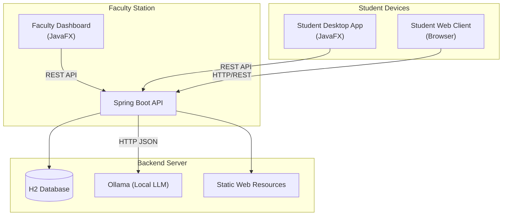

# 🎓 Smart Quiz System

A modern, hybrid quiz platform designed for seamless interaction between Faculty and Students. This system combines a robust **JavaFX Desktop Application** for faculty management with a flexible **Web Client** for student participation, powered by a **Spring Boot** backend.

---

## 🚀 Key Features

### 👨‍🏫 Faculty Dashboard (Desktop App)
*   **AI-Powered Generation**: Generates high-quality questions from text/PDF using local LLMs (**Ollama/Gemma**).
*   **Fast & Reliable**: Uses **Parallel Request Batching** to generate 100+ questions in seconds without crashing.
*   **Smart Recovery**: Automatically fixes cut-off JSON using intelligent repair logic.
*   **Interactive UI**: Includes **Loading Indicators** and **Cancel** options for long operations.
*   **Question Management**: Review, edit, and customize generated questions before starting the session.
*   **Session Management**: Start a new quiz session with a unique **Session ID** and **OTP**.
*   **Live Scoreboard**: Monitor student progress in real-time with a dynamic scoreboard.

### 👨‍🎓 Student Client (Hybrid Access)
*   **Cross-Platform**: Accessible via **Desktop App** (JavaFX) or **Web Client** (Mobile/Laptop).
*   **Secure Access**: Register with Enrollment ID and join via OTP.
*   **Anti-Cheating**: Tab-switch detection (Web) to ensure integrity.
*   **Instant Feedback**: View scores and detailed explanations immediately after submission.

---

## 🛠️ Technology Stack

*   **Backend**: Java 17, Spring Boot 3, Spring Security, H2 Database.
*   **AI Engine**: **Ollama** (Local LLM), running `gemma:2b` or custom models.
*   **Frontend (Desktop)**: JavaFX 19, CSS3 (Modern Glassmorphism UI).
*   **Frontend (Web)**: HTML5, CSS3, Vanilla JavaScript (SPA).
*   **Performance**: `CompletableFuture` for asynchronous, parallel AI processing.

---

## 🏗️ Architecture



---

## 📦 Installation & Setup

### Prerequisites
*   **Java 17** or higher.
*   **Maven** installed.
*   **Ollama** installed ([Download Here](https://ollama.com)).

### 1. Setup AI Model
Pull the lightweight Gemma model:
```bash
ollama run gemma:2b
```

### 2. Start the Backend Server
The backend hosts the API and the Student Web Client.
```bash
cd backend
mvn spring-boot:run
```
*Server starts at `http://localhost:8080`*

### 3. Run the Faculty Dashboard / Student App
Open a new terminal:
```bash
cd client
mvn javafx:run
```
*Select "Faculty" to generate questions or "Student" to take a quiz.*

### 4. Student Web Access
Open your browser (or phone on same WiFi) and navigate to:
`http://localhost:8080` or `http://<YOUR_CTX_IP>:8080`

---

## 📖 Usage Guide

1.  **Faculty**:
    *   **Login**: Use faculty credentials.
    *   **Generate**: Paste syllabus -> "Generate Questions" (watches the loading bar!).
    *   **Review**: Edit questions if needed -> "Start Session".
    *   **Monitor**: Share ID/OTP and watch the live scoreboard.

2.  **Student**:
    *   **Join**: Enter ID & OTP.
    *   **Quiz**: Answer questions (clean, focused UI).
    *   **Result**: See score and explanations instantly.

---

## 🤝 Contributing
Feel free to fork this repository and submit pull requests.

---

**Developed by Daku3011 and Moonshine**
