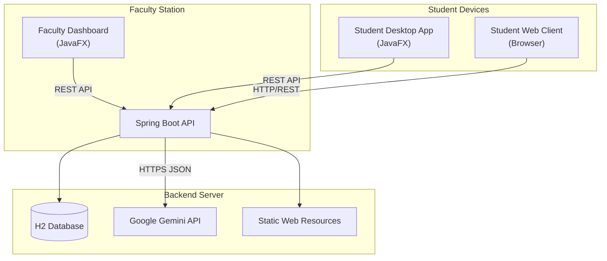

# 🎓 Smart Quiz System

A modern, hybrid quiz platform designed for seamless interaction between Faculty and Students. This system combines a robust **JavaFX Desktop Application** for faculty management with a flexible **Web Client** for student participation, powered by a **Spring Boot** backend.

---

## 🚀 Key Features

### 👨‍🏫 Faculty Dashboard (Desktop App)
*   **AI-Powered Generation**: Generates high-quality questions from syllabus text using **Google Gemini 2.5 Flash**.
*   **Fast & Reliable**: Uses **Parallel Request Batching** to generate large question sets efficiently.
*   **Smart Recovery**: Automatically fixes cut-off JSON using intelligent repair logic.
*   **Interactive UI**: Includes **Loading Indicators**, **Cancel** options, and a rich **PCB/Scoreboard** interface.
*   **Question Management**: Review, edit, and customize generated questions before starting the session.
*   **Session Management**: Start a new quiz session with a unique **Session ID** and **OTP**.
*   **Live Scoreboard**: Monitor student progress in real-time with formatting and printing capabilities.

### 👨‍🎓 Student Client (Hybrid Access)
*   **Cross-Platform**: Accessible via **Connection-based Desktop App** or **Web Browser**.
*   **Secure Access**: Register with Enrollment ID and join via OTP.
*   **Waiting Room**: Real-time polling keeps students synchronized until the exam starts.
*   **Anti-Cheating**: 
    *   **Randomized Sets**: Different question orders (Set A, B, C...) for every student.
    *   **Tab Switch Detection**: Web client flags or blocks tab switching.
*   **Instant Feedback**: View scores, correct answers, and AI-generated explanations immediately after submission.

---

## 🛠️ Technology Stack

*   **Backend**: Java 17, Spring Boot 3, Spring Security, H2 Database (In-Memory).
*   **AI Engine**: **Google Gemini API** (`gemini-2.5-flash`).
*   **Frontend (Desktop)**: JavaFX 19, CSS3 (Modern Glassmorphism UI).
*   **Frontend (Web)**: HTML5, CSS3, Vanilla JavaScript (SPA).
*   **Logging**: SLF4J with Logback for comprehensive system tracing.

---

## 🏗️ Architecture



---

## 📦 Installation & Setup

### Prerequisites
*   **Java 17** or higher.
*   **Maven** installed.
*   **Google Gemini API Key**.

### 1. Configure the Backend
Create a `.env` file in the `backend` directory:
```properties
GEMINI_API_KEY=your_actual_api_key_here
```

### 2. Start the Backend Server
The backend hosts the API and the Student Web Client.
```bash
cd backend
mvn spring-boot:run
```
*Server starts at `http://localhost:8080`*

### 3. Run the Faculty Dashboard / Student App
Open a new terminal:
```bash
cd client
mvn javafx:run
```
*Select "Faculty" to generate questions or "Student" to take a quiz.*

### 4. Student Web Access
Open your browser (or phone on same WiFi) and navigate to:
`http://localhost:8080`
*Alternatively, use the IP address of the host machine for mobile testing.*

---

## 📖 Usage Guide

1.  **Faculty**:
    *   **Login**: Use faculty credentials.
    *   **Generate**: Paste syllabus -> "Generate Questions".
    *   **Review**: Edit questions if needed -> "Start Session".
    *   **Monitor**: Share ID/OTP and watch the live scoreboard.

2.  **Student**:
    *   **Join**: Enter Session ID & OTP.
    *   **Quiz**: Answer questions (clean, focused UI).
    *   **Result**: See score and explanations instantly.

---

## 🤝 Contributing
Feel free to fork this repository and submit pull requests.

---

**Developed by Daku3011 and Moonshine**
