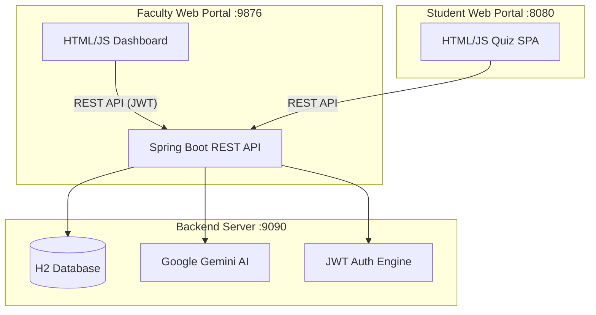

# Smart Quiz System: Technical Documentation & Project Deep-Dive

Welcome to the technical heart of the **Smart Quiz System**. This document provides an exhaustive breakdown of the project's architecture, directory structure, and the specific roles of its various components.

---

## 🏗️ Project Architecture Overview

The Smart Quiz System is designed with a modern, **fully decoupled 3-service architecture**:

1. **Backend API** (Spring Boot) — The single source of truth for data, security, and AI.
2. **Faculty Web Portal** (Static HTML/JS) — Management dashboard for instructors.
3. **Student Web Portal** (Static HTML/JS) — Secure exam interface for students.



### Communication Flow

1. **Faculty** authenticates via JWT → receives access + refresh tokens.
2. Faculty uploads syllabus text/PDF → Backend sends to **Gemini AI** → returns structured MCQs.
3. Faculty starts a session → Backend generates an **OTP** → Faculty shares Session ID + OTP with students.
4. **Students** enter Session ID + OTP → Backend validates → serves randomized question sets.
5. Students submit answers → Backend scores, flags cheating, saves submissions.
6. Faculty views **live scoreboard** and **CO analytics** in real-time.

---

## 📂 Complete Directory Structure

```text
QuizFinal/
├── backend/                          # ── Spring Boot Server ──
│   ├── Dockerfile                    # Multi-stage Docker build (Maven → JRE 17)
│   ├── pom.xml                       # Maven dependencies & build config
│   ├── .env                          # GEMINI_API_KEY (gitignored)
│   └── src/main/java/com/quiz/
│       ├── QuizApplication.java      # Main entry point
│       ├── config/
│       │   ├── SecurityConfig.java   # CORS, role-based access, endpoint security
│       │   ├── JwtUtils.java         # JWT generation, validation, claims extraction
│       │   ├── JwtAuthenticationFilter.java  # Request filter for Bearer tokens
│       │   └── DataInitializer.java  # Auto-creates default admin account on startup
│       ├── controller/
│       │   ├── AuthController.java        # POST /login, /refresh, /logout
│       │   ├── SessionController.java     # Session lifecycle (start, join, stop, status)
│       │   ├── SyllabusController.java    # AI question generation & syllabus analysis
│       │   ├── QuizController.java        # Quiz submission, scoring, result generation
│       │   ├── ScoreboardController.java  # Live scoreboard per session
│       │   ├── AnalyticsController.java   # Aggregated CO & student analytics
│       │   ├── AdminController.java       # Faculty account management
│       │   ├── StudentController.java     # Student registration & login
│       │   └── TestController.java        # Health check endpoint
│       ├── dto/                      # Data Transfer Objects for request validation
│       ├── model/                    # JPA Entities (Database Schema)
│       │   ├── User.java            # Faculty/Admin accounts (username, password, role)
│       │   ├── Role.java            # Enum: ADMIN, FACULTY
│       │   ├── Faculty.java         # Faculty profile details
│       │   ├── Session.java         # Exam session (subject, duration, sets, timing)
│       │   ├── Student.java         # Student info (name, enrollment, sessionId)
│       │   ├── Question.java        # MCQ (text, options A-D, correct, CO, chapter, bloom)
│       │   ├── Answer.java          # Individual answer record
│       │   ├── Submission.java      # Quiz submission (score, details JSON, cheated flag)
│       │   ├── Otp.java             # OTP record linked to session
│       │   └── Syllabus.java        # Syllabus text storage
│       ├── repository/              # Spring Data JPA Repositories (8 interfaces)
│       ├── service/
│       │   ├── AIService.java              # Gemini API integration (generate + analyze)
│       │   ├── SessionService.java         # Session CRUD & OTP validation
│       │   ├── OTPService.java             # 6-digit OTP generation & management
│       │   ├── TokenBlacklistService.java  # In-memory JWT blacklist for logout
│       │   └── CustomUserDetailsService.java  # Spring Security UserDetails adapter
│       └── util/
│           └── PasswordValidator.java      # Password strength validation
│
├── faculty_portal/                   # ── Faculty Dashboard (Static Site) ──
│   ├── index.html                    # Main SPA (~28KB) — tabs for Session, Questions, Analytics
│   ├── login.html                    # Login page with dark theme
│   ├── css/
│   │   └── style.css                 # Dark navy theme, glassmorphism, responsive
│   ├── js/
│   │   ├── app.js                    # All dashboard logic (~35KB)
│   │   └── config.js                 # API_BASE_URL configuration
│   └── icons/                        # Custom SVG icons (favicon, portal icons)
│
├── student_portal/                   # ── Student Quiz Interface (Static Site) ──
│   ├── index.html                    # Quiz SPA (~13KB)
│   ├── favicon.svg                   # Portal icon
│   ├── css/                          # Modular CSS architecture
│   │   ├── variables.css             # CSS custom properties (colors, spacing, fonts)
│   │   ├── theme.css                 # Dark theme token definitions
│   │   ├── reset.css                 # CSS reset / normalize
│   │   ├── layout.css                # Grid & flex layout utilities
│   │   ├── components.css            # UI component styles (cards, buttons, modals)
│   │   ├── style.css                 # Page-specific styles
│   │   └── responsive.css            # Mobile & tablet breakpoints
│   ├── js/                           # Modular JavaScript architecture
│   │   ├── config.js                 # API_BASE_URL configuration
│   │   ├── api.js                    # HTTP client class + all API endpoint wrappers
│   │   ├── app.js                    # Core quiz state machine & flow control
│   │   ├── auth.js                   # Student authentication & session join flow
│   │   ├── components.js             # UI rendering components
│   │   ├── utils.js                  # Helpers, timer, anti-cheat monitoring
│   │   └── app.test.js               # JavaScript unit tests
│   └── assets/                       # Static assets directory
│
├── client/                           # ── JavaFX Desktop Client (Legacy) ──
│   ├── pom.xml                       # Maven config for JavaFX
│   └── src/                          # Desktop app source (not actively maintained)
│
├── run.sh                            # 🚀 Launch all 3 services (Linux/Mac)
├── run.bat                           # 🚀 Launch all 3 services (Windows)
├── setup.sh                          # 🔧 Dependency check & build script
├── show_access_urls.sh               # 📱 Display LAN access URLs
├── show_access_urls.bat              # 📱 Display LAN access URLs (Windows)
├── .gitignore                        # Ignores: target/, .env, .vscode/, logs
├── README.md                         # Project overview & setup guide
└── info.md                           # This file (Technical deep-dive)
```

---

## 🔍 Detailed Component Breakdown

### 1. Backend Service (`/backend`)

The backend is the **single source of truth** — all data, authentication, and AI logic flows through it.

#### Security & Authentication (`config/`)
- **`SecurityConfig.java`** — Configures CORS (allows all origins for LAN access), disables CSRF for REST API, defines public vs protected endpoints, and sets up the authentication manager.
- **`JwtUtils.java`** — Generates JWT access tokens (short-lived) and refresh tokens (long-lived). Extracts claims and validates signatures.
- **`JwtAuthenticationFilter.java`** — Spring filter that intercepts every request, extracts the Bearer token, validates it against the blacklist, and sets the security context.
- **`DataInitializer.java`** — Runs on startup to seed the database with a default admin account (`admin`/`admin123`).

#### Controllers (`controller/`) — The API Gateway
| Controller | Endpoints | Responsibility |
| :--- | :--- | :--- |
| `AuthController` | `/api/auth/*` | JWT login, token refresh, logout with blacklisting |
| `SessionController` | `/api/session/*` | Full session lifecycle: create, join (OTP), get questions (shuffled), status, active list, stop |
| `SyllabusController` | `/api/syllabus/*` | Forward syllabus text/PDF to Gemini AI, return structured MCQs; analyze syllabus topics |
| `QuizController` | `/api/quiz/*` | Score submissions, detect cheating, save results with answer details JSON, auto-recover students |
| `ScoreboardController` | `/api/session/{id}/scoreboard` | Pull live scores with student names, enrollment, question set, cheat flags |
| `AnalyticsController` | `/api/analytics/*` | Aggregated session analytics (avg/high/low scores, per-CO performance); per-student breakdowns |
| `AdminController` | `/api/admin/*` | Create faculty accounts with password validation; retrieve all submissions |
| `StudentController` | `/api/student/*` | Student registration with OTP validation and duplicate enrollment check |

#### Services (`service/`) — Business Logic
- **`AIService.java`** (~38KB) — The largest file. Constructs detailed prompts for Google Gemini with topic weights, Bloom's taxonomy levels, and CO mapping. Parses JSON responses into `Question` objects. Also supports syllabus analysis (topic extraction).
- **`SessionService.java`** — Creates sessions with configurable duration, number of sets, and subject metadata. Validates OTPs on student join.
- **`OTPService.java`** — Generates secure 6-digit OTPs, stores them linked to sessions, and handles expiry validation.
- **`TokenBlacklistService.java`** — In-memory set of blacklisted JWT tokens (for logout). Tokens are removed on expiry.

#### Models (`model/`) — Database Schema
| Entity | Key Fields | Purpose |
| :--- | :--- | :--- |
| `User` | username, password (BCrypt), role | Faculty/Admin authentication |
| `Role` | ADMIN, FACULTY | Role-based access control |
| `Session` | subject, duration, numberOfSets, startTime, endTime, active | Exam session configuration |
| `Question` | text, optionA-D, correct, chapter, courseOutcome, bloomLevel, explanation | AI-generated MCQ |
| `Student` | name, enrollment, sessionId | Registered exam taker |
| `Submission` | studentId, sessionId, score, details (JSON), cheated, questionSet | Scored quiz result |
| `Otp` | code, sessionId, expiresAt | Session entry credential |

### 2. Faculty Web Portal (`/faculty_portal`)

A rich, single-page dashboard providing full control over the exam workflow.

- **`login.html`** — Standalone login page with dark theme. Sends credentials to `/api/auth/login`, stores JWT in `localStorage`.
- **`index.html`** — The main dashboard with tabbed navigation:
    - **Session Tab** — Create sessions, configure duration & sets, view active sessions.
    - **Questions Tab** — Upload syllabus (text or PDF), configure topic weights, generate questions via AI, review/edit/add questions manually.
    - **Results Tab** — Live scoreboard, CO analytics charts, per-student detailed breakdowns.
- **`js/app.js`** (~35KB) — All dashboard logic including API calls, DOM manipulation, modal management, and real-time polling.
- **`js/config.js`** — Single config file to set the backend API URL (auto-detects hostname for LAN use).
- **`css/style.css`** — Dark navy theme with purple gradients, glassmorphism cards, custom icons, and responsive layout.

### 3. Student Web Portal (`/student_portal`)

A zero-dependency, modular quiz interface optimized for reliability and anti-cheating.

- **`js/api.js`** — Full HTTP client (`APIClient` class) with typed endpoint wrappers for student, session, quiz, question, faculty, auth, and analytics APIs.
- **`js/app.js`** (~25KB) — Core state machine managing the exam flow: join → wait → quiz → submit → results.
- **`js/auth.js`** — Student authentication: session ID + OTP validation, registration, session storage persistence.
- **`js/components.js`** — Reusable UI rendering functions (question cards, timer, progress bar, results display).
- **`js/utils.js`** — Anti-cheat monitoring (visibility change, tab switch counting), timer utilities, data formatters.
- **`js/app.test.js`** — Unit tests for the student portal JavaScript.
- **CSS Architecture** — 7 modular CSS files: variables → theme → reset → layout → components → style → responsive.

### 4. JavaFX Desktop Client (`/client`) — Legacy

The desktop client was the original faculty interface, built with JavaFX. It has been **superseded by the Faculty Web Portal** and is no longer actively maintained. It remains in the repo for reference.

---

## 🛠️ Key Technical Decisions

| Decision | Rationale |
| :--- | :--- |
| **H2 Embedded Database** | Zero-config, portable. Perfect for lab environments where no external DB is needed. |
| **JWT over Sessions** | Stateless auth allows the backend to scale and supports cross-origin frontend portals. |
| **Vanilla JS (no React/Vue)** | Minimal dependencies, fast load times, works offline. Critical for unreliable lab networks. |
| **Python HTTP Server for portals** | Simplest way to serve static files without bundling. Any machine with Python 3 can host. |
| **Question Set Shuffling** | `studentId % numberOfSets` determines the set. Deterministic but unique per student. |
| **Auto-Recovery on Submit** | If server restarts mid-exam, students can still submit — the backend recreates their identity from the request payload. |

---

## ⚡ Technical Stack Summary

| Component     | Technology |
| :------------ | :--------- |
| **Language**  | Java 17+, JavaScript (ES6), CSS3, HTML5 |
| **Backend**   | Spring Boot 3.0, Spring Security, Spring Data JPA, Jackson |
| **Auth**      | JWT (Access + Refresh), BCrypt, Token Blacklisting |
| **AI**        | Google Gemini API (1.5 Flash) |
| **Database**  | H2 (Embedded SQL) |
| **Deployment**| Docker (multi-stage), Render, Static Sites |
| **Scripts**   | Bash, Batch (cross-platform launchers) |

---

*Last updated: February 2026 — reflects the current state of the project including JWT auth, modular student portal, CO analytics, dark theme UI, and LAN access support.*
