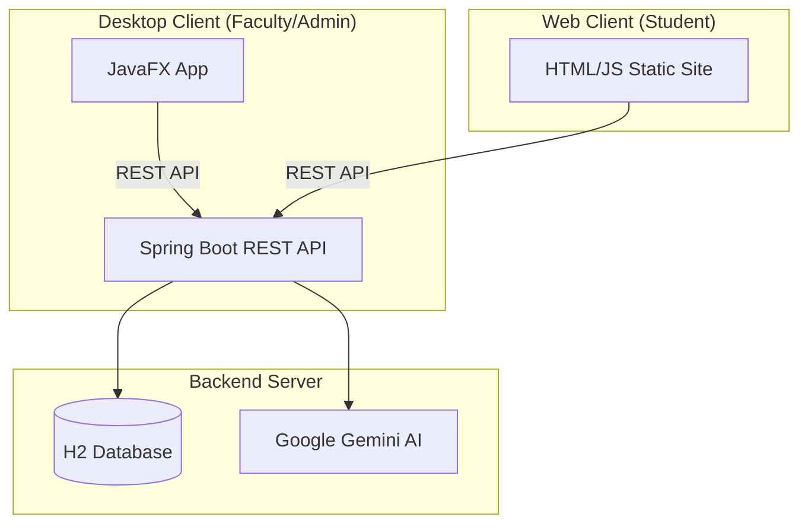

# Quiz Master: Technical Documentation & Project Structure

Welcome to the technical heart of **Quiz Master**. This document provides an exhaustive breakdown of the project's architecture, directory structure, and the specific roles of its various components.

---

## 🏗️ Project Architecture Overview

Quiz Master is designed with a modern, decoupled architecture consisting of a **Spring Boot Backend**, a **JavaFX Desktop Client** for administrative/faculty use, and a **Lightweight Web Client** for students taking exams.



---

## 📂 Visual File Structure

Below is the complete directory tree of the Quiz Master project:

```text
QuizFinal/
├── backend/                  # Spring Boot Server Application
│   ├── src/main/java/com/quiz/
│   │   ├── QuizApplication.java  # Main entry point for the backend
│   │   ├── config/           # Security and data initialization logic
│   │   ├── controller/       # Web REST endpoints (API Layers)
│   │   ├── dto/              # Data Transfer Objects for API requests
│   │   ├── model/            # JPA Entities (Database Schema)
│   │   ├── repository/       # Data Access Layer (Spring Data JPA)
│   │   └── service/          # Core Business Logic (AI, OTP, Sessions)
│   └── src/main/resources/
│       ├── application.properties # Server configuration (DB, API Keys)
│       └── static/           # Student Web Client (HTML, CSS, JS)
├── client/                   # JavaFX Desktop Application
│   ├── src/main/java/com/quizclient/
│   │   ├── MainApp.java      # Desktop application entry point
│   │   ├── ApiClient.java    # Shared HTTP client for backend communication
│   │   ├── controllers/      # UI logic for FXML views
│   │   └── dto/              # Client-side data models
│   └── src/main/resources/
│       ├── css/              # Premium styling for the JavaFX app
│       └── fxml/             # UI Layout definitions for various screens
├── info.md                   # You are here (Project Documentation)
├── README.md                 # Basic setup and overview
├── setup.sh                  # One-click environment setup
└── run.sh                    # Convenience script to start both apps
```

---

## 🔍 Detailed Component Breakdown

### 1. Backend Service (`/backend`)
The backend is the "Single Source of Truth" and handles all data persistence, security, and AI logic.

*   **`config/`**: Contains `SecurityConfig.java` (CORS policies, role-based access) and `DataInitializer.java` (automatic admin account setup).
*   **`controller/`**: The API Gateway.
    *   `SessionController`: Manages the lifecycle of an exam (Start, Join, Status).
    *   `SyllabusController`: Receives syllabus text and triggers question generation.
    *   `QuizController`: The submission engine that scores student answers.
    *   `AuthController`: Manages secure login for faculty and admins.
*   **`service/`**: Where the heavy lifting happens.
    *   `AIService`: Communicates with Google Gemini to generate high-quality engineering questions.
    *   `OTPService`: Generates and manages the 6-digit passwords used by students to join.
*   **`model/`**: Defines the database entities like `Question`, `Student`, `Session`, and `Submission`.

### 2. Desktop Client (`/client`)
Built for Faculty and Admins, this application provides a premium GUI experience.

*   **`controllers/`**: 
    *   `FacultyDashboardController`: The primary hub for creating sessions and uploading syllabi.
    *   `AdminDashboardController`: Used for managing faculty accounts and viewing system-wide archives.
    *   `SyllabusEditorController`: Provides a dedicated environment for refining AI-generated content.
*   **`resources/fxml/`**: XML files that define the structural layout of the application.
*   **`resources/css/`**: Contains `theme.css`, which implements a modern dark mode with glassmorphism effects.

### 3. Student Web Interface (`/static`)
A no-build, static site hosted by the backend, optimized for reliability during exams.

*   **`index.html`**: A responsive SPA (Single Page Application) that adapts to the current exam state.
*   **`js/app.js`**: Contains the core student-side logic, including:
    *   **Anti-Cheating Monitoring**: Detects tab switches and focus loss.
    *   **State Recovery**: Uses `sessionStorage` so students don't lose work if they refresh.
    *   **Session Polling**: Automatically checks when a faculty member starts the exam.

---

## 🛠️ Technical Manifest

| Component | Responsibility | Technical Importance |
| :--- | :--- | :--- |
| **Backend Core** | | |
| `QuizApplication.java` | Entry Point | Starts the Spring context. |
| `AIService.java` | Question Brain | Converts raw syllabus text into structured MCQs. |
| `SecurityConfig.java` | Protection | Manages AUTH and CORS; critical for safety. |
| **Client UI** | | |
| `FacultyDashboard.fxml`| Workflow | The main interaction point for faculty users. |
| `theme.css` | Brand Identity | Provides the premium "wow" factor for the GUI. |
| **Web Service** | | |
| `app.js` | Exam Flow | Manages the student experience and exam integrity. |

---

## ⚡ Technical Stack

- **Languages**: Java 17+, JavaScript (ES6), CSS3, HTML5.
- **Backend**: Spring Boot, Spring Data JPA, Spring Security, Jackson (JSON parsing).
- **Desktop**: JavaFX, Maven, OpenJDK.
- **AI**: Google Gemini Pro (Generative AI).
- **Database**: H2 (Embedded SQL).

---
*Created by Antigravity - Optimized for Clarity and Intent.*
